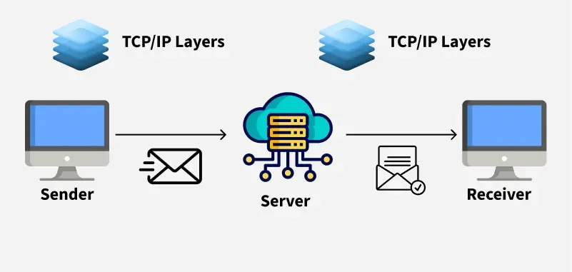
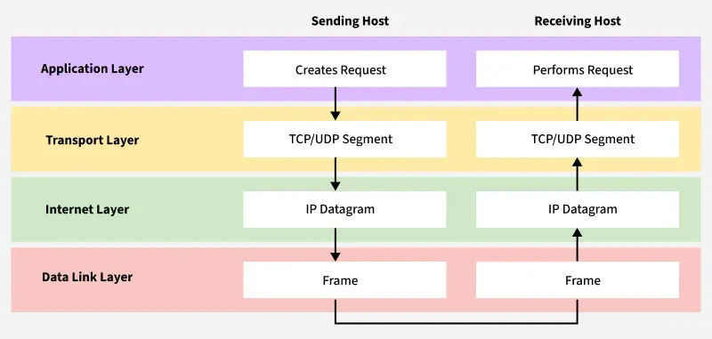

# What is TCP/IP Model?

The TCP/IP model (Transmission Control Protocol/Internet Protocol) is a four-layer networking framework that enables reliable communication between devices over interconnected networks. It provides a standardized set of protocols for transmitting data across interconnected networks, ensuring efficient and error-free delivery. Each layer has specific functions that help manage different aspects of network communication, making it essential for understanding and working with modern networks.

TCP/IP was designed and developed by the Department of Defense (DoD) in the 1970s and is based on standard protocols. The TCP/IP model is a concise version of the OSI model. It contains four layers, unlike the seven layers in the OSI model.

## Role of TCP/IP

TCP/IP enables interoperability between diverse systems over various network types (e.g., copper, fiber, wireless). It ensures seamless communication across LANs, WANs, and the internet. Without TCP/IP, large-scale global networking would not be possible.

The main condition of this process is to make data reliable and accurate so that the receiver will receive the same information which is sent by the sender. To ensure that, each message reaches its final destination accurately, the TCP/IP model divides its data into packets and combines them at the other end, which helps in maintaining the accuracy of the data while transferring from one end to another end.

---

## Layers of TCP/IP Model

It’s composed of four interconnected layers compared to the seven layers in the OSI model. Each layer performs a specific task on the data that is being transmitted over the network channel, and data moves from one layer to another.

- Application Layer  
- Transport Layer (TCP/UDP)  
- Network/Internet Layer (IP)  
- Network Access Layer  

---

## 1. Application Layer

The Application Layer is the closest to the end user and is where applications and user interfaces reside. It serves as the bridge between user programs and the lower layers responsible for data transmission.

**Function:** Provides services and interfaces for end-user applications to access network resources.

**Key responsibilities:**
- Supports application protocols like HTTP, FTP, SMTP, DNS, etc.
- Enables communication between software applications across networks.
- Handles data formatting, encryption, and session management.

---

## 2. Transport Layer

This layer ensures data is delivered reliably and in the correct order between devices. The two main protocols in this layer are TCP (Transmission Control Protocol) and UDP (User Datagram Protocol).

**Function:** Ensures reliable or unreliable delivery of data between hosts.

**Key responsibilities:**
- **TCP:** Reliable, connection-oriented delivery with error checking, retransmission, and flow control.
- **UDP:** Faster, connectionless transmission without guarantees.
- Manages flow control and segmentation/reassembly of data.

---

## 3. Internet Layer

It handles the routing of data packets across networks. It uses the Internet Protocol (IP) to assign unique IP addresses to devices and decide the most efficient path for data to reach its destination.

**Function:** Determines the best path for data to travel across networks.

**Key responsibilities:**
- **IP (Internet Protocol):** Provides addressing and routing.
- Handles packet forwarding, fragmentation, and logical addressing.
- Involves protocols like IP, ICMP (for diagnostics), and ARP (for address resolution).

---

## 4. Network Access Layer

This layer is the lowest layer in the model and responsible for the physical connection between devices within the same network segment.

**Function:** Manages the physical transmission of data over the network hardware.

**Key responsibilities:**
- Handles how data is physically sent over cables, Wi-Fi, etc.
- Manages MAC addressing, framing, and error detection at the physical link.
- Includes Ethernet, Wi-Fi, and other data link technologies.

---

## Working of TCP/IP Model

### When Sending Data (From Sender to Receiver)

1. **Application Layer**  
   - A user sends data through an application (e.g., opening a website via a browser).  
   - The application prepares data for transmission (e.g., using HTTP, FTP, SMTP).  

2. **Transport Layer (TCP/UDP)**  
   - TCP breaks data into small segments, adds headers (sequence numbers, ports).  
   - Ensures reliable delivery (TCP) or fast, connectionless delivery (UDP).  

3. **Internet Layer (IP)**  
   - Adds IP addresses to each packet (source and destination).  
   - Determines the packet's route to the destination.  

4. **Network Access Layer**  
   - Converts packets into frames, adds MAC addresses.  
   - Sends data as binary over the physical medium (Ethernet, Wi-Fi).  

---

### When Receiving Data (At the Destination)

1. **Network Access Layer**  
   - Receives bits and reconstructs frames.  
   - Passes frames up to the Internet layer.  

2. **Internet Layer**  
   - Confirms IP address matches the recipient.  
   - Removes IP header, sends data to Transport layer.  

3. **Transport Layer**  
   - Reassembles segments, checks integrity with acknowledgments and checksums.  

4. **Application Layer**  
   - Delivers data to the correct application (e.g., browser displays web page).  

---

## Why TCP/IP is Used Over the OSI Model

| Reason                  | Explanation |
|-------------------------|-------------|
| **Simpler Structure** | TCP/IP has only 4 layers, compared to 7 in OSI, making it easier to implement. |
| **Protocol-Driven** | TCP/IP was based on real, working protocols, unlike the theoretical OSI model. |
| **Flexibility** | TCP/IP works with different hardware/networks and includes routing/error control. |
| **Open Standard** | Free to use, open to all, not controlled by a single organization. |
| **Real-World Use** | OSI is mostly conceptual; TCP/IP is actually used in the real world. |

---

## Advantages of TCP/IP Model

- **Interoperability:** Works across diverse systems and platforms.  
- **Scalability:** Suitable for small LANs to the global internet.  
- **Standardization:** Based on open standards; ensures compatibility.  
- **Flexibility:** Supports various protocols, media, and formats.  
- **Reliability:** Includes error handling and retransmission.

---

## Disadvantages of TCP/IP Model

- **Security Concerns:** Lacks built-in security; relies on additional protocols.  
- **Inefficient for Small Networks:** Complexity might be unnecessary for small setups.  
- **Address Limitation:** IPv4 has limited address space (mitigated by IPv6).  
- **Data Overhead:** TCP has extra overhead that can reduce speed for small data packets.

